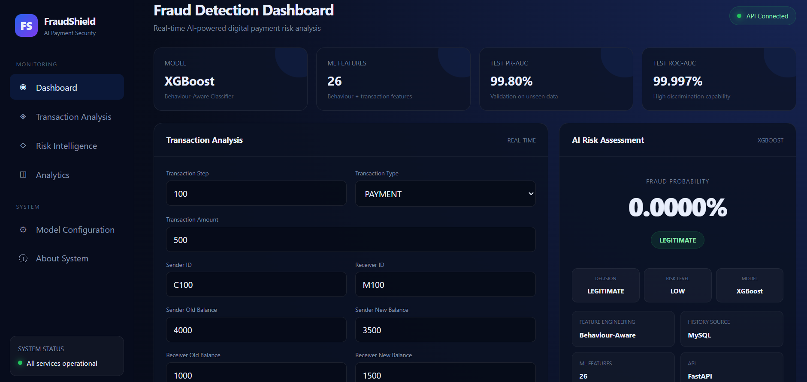
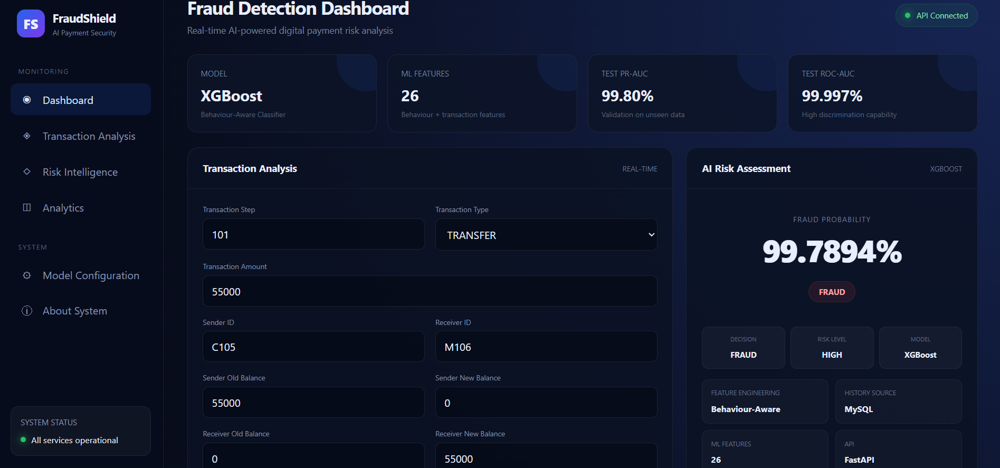

# 🛡️ FraudShield

## AI-Based Behaviour-Aware Real-Time Payment Fraud Detection System

FraudShield is an AI-powered payment fraud detection system designed to analyze digital payment transactions in real time and identify potentially fraudulent behaviour.

The system combines machine learning, behavioural analysis, transaction validation, REST APIs, database storage, and an interactive web dashboard into a complete end-to-end fraud detection platform.

### 🔴 High-Risk Transaction Detection



---

## 🚀 Live Demo

🌐 **Frontend:**  
https://fraudshield-frontend-bqor.onrender.com/

🔗 **Backend API:**  
https://fraudshield-vvs5.onrender.com/

📚 **API Documentation:**  
https://fraudshield-vvs5.onrender.com/docs

---

## ✨ Key Features

- 🔍 Real-time payment fraud detection
- 🤖 XGBoost-based fraud classification
- 🧠 Behaviour-aware transaction analysis
- 📊 26 machine-learning features
- ⚠️ Risk-level classification
- 💡 Explainable risk factors
- ✅ Transaction validation
- 🗄️ MySQL database integration
- ⚡ FastAPI REST API
- 📈 Transaction analytics dashboard
- 🌐 Cloud deployment
- 🔐 Database-backed transaction history

---

## 🧠 Machine Learning

FraudShield uses an **XGBoost classifier** for payment fraud detection.

The system incorporates behavioural features such as:

- Previous transaction amount
- Previous average transaction amount
- Time since previous transaction
- Amount deviation
- Amount-to-previous-average ratio
- Balance depletion
- Amount-to-balance ratio
- Receiver transaction history
- Receiver transaction frequency
- User transfer count
- User cash-out count
- Transaction velocity
- Transaction type features

These features allow the system to analyze not only the current transaction but also the transaction behaviour of the sender and receiver.

---

## 📊 Model Performance

The current deployed dashboard reports:

| Metric | Result |
|---|---:|
| ROC-AUC | **99.997%** |
| PR-AUC | **99.80%** |
| ML Features | **26** |

> Performance metrics are based on the project's model evaluation and should be interpreted in the context of the PaySim dataset and its class distribution.

---

## 🏗️ System Architecture

```text
                    ┌─────────────────────┐
                    │    Web Dashboard    │
                    │   HTML/CSS/JS       │
                    └──────────┬──────────┘
                               │
                               ▼
                    ┌─────────────────────┐
                    │     FastAPI API     │
                    │     /predict        │
                    └──────────┬──────────┘
                               │
                ┌──────────────┴──────────────┐
                │                             │
                ▼                             ▼
       ┌─────────────────┐          ┌─────────────────┐
       │ Behaviour-Aware │          │   Transaction   │
       │   Feature       │          │   Validation    │
       │   Engineering   │          └─────────────────┘
       └────────┬────────┘
                │
                ▼
       ┌─────────────────┐
       │ XGBoost Model   │
       │ Fraud Classifier│
       └────────┬────────┘
                │
                ▼
       ┌─────────────────┐
       │ Risk Assessment │
       │ LOW/MEDIUM/HIGH │
       └────────┬────────┘
                │
                ▼
       ┌─────────────────┐
       │    MySQL DB     │
       │ Transaction Data│
       └─────────────────┘
## 🛠️ Technology Stack

### 🤖 Machine Learning

- Python
- Pandas
- NumPy
- Scikit-learn
- XGBoost

### ⚡ Backend

- FastAPI
- Uvicorn
- Pydantic

### 🗄️ Database

- MySQL
- Aiven MySQL

### 🌐 Frontend

- HTML
- CSS
- JavaScript

### ☁️ Deployment

- Render
- Aiven

### 🧰 Development Tools

- Git
- GitHub
- VS Code
- Jupyter Notebook

---

## 📂 Project Structure

```text
FraudShield/
│
├── frontend/
├── src/
│   ├── database.py
│   ├── feature_engineering.py
│   └── predictor.py
│
├── models_saved/
├── notebooks/
├── tests/
├── dashboard.png
├── high-risk-detection.png
├── main.py
├── requirements.txt
├── .gitignore
└── README.md

---

## 📡 API Endpoints

| Endpoint | Method | Purpose |
|---|---|---|
| `/` | GET | API information |
| `/health` | GET | System and database health |
| `/db-test` | GET | Test database connection |
| `/predict` | POST | Analyze a transaction |
| `/transactions` | GET | Retrieve recent transactions |
| `/analytics` | GET | View transaction analytics |
| `/docs` | GET | Interactive Swagger API documentation |

---

## 🧪 Example Transaction

```json
{
  "step": 100,
  "type": "TRANSFER",
  "amount": 54000,
  "nameOrig": "C101",
  "oldbalanceOrg": 54000,
  "newbalanceOrig": 0,
  "nameDest": "M101",
  "oldbalanceDest": 0,
  "newbalanceDest": 54000,
  "isFlaggedFraud": 0
}


The system validates the transaction, generates behaviour-aware features, sends them to the XGBoost model, calculates fraud probability, assigns a risk level, generates risk factors, and stores the transaction result in MySQL.

---

## 🔐 Transaction Validation

Before prediction, FraudShield validates transaction consistency.

The system checks:

- Transaction amount is non-negative
- Sender balances are valid
- Receiver balances are valid
- Transaction amount does not exceed sender balance
- Sender balance transition is mathematically consistent
- Receiver balance transition is mathematically consistent

Invalid transactions are rejected before being processed by the fraud detection model.

---

## 📊 Risk Assessment

After validation and feature engineering, FraudShield generates a fraud probability and assigns a risk level.

| Risk Level | Description |
|---|---|
| 🟢 LOW | Low estimated fraud probability |
| 🟡 MEDIUM | Moderate estimated fraud probability |
| 🔴 HIGH | High estimated fraud probability |

The system also generates behavioural risk factors to explain suspicious transaction patterns.

---

## 📈 Analytics

FraudShield provides transaction-level analytics through the web dashboard.

The analytics module provides:

- Total transactions processed
- Fraudulent transactions
- Legitimate transactions
- Fraud rate
- Total transaction amount
- Average fraud probability
- Risk-level distribution
- Transaction-type distribution

These analytics help provide an overview of transaction activity and detected risk patterns.

---

## 🧪 Testing

FraudShield includes validation and API testing to verify system behaviour.

The system has been tested for:

- Valid payment transactions
- High-risk transfer transactions
- Invalid balance calculations
- Insufficient sender balance
- Negative transaction amounts
- API health and database connectivity
- Real-time fraud prediction
- Transaction history storage

The FastAPI Swagger interface can be used to test the API endpoints interactively.

**Swagger Documentation:**  
https://fraudshield-vvs5.onrender.com/docs

---

## 📌 Project Status

FraudShield is currently deployed and operational.

| Component | Status |
|---|---|
| 🤖 XGBoost Model | ✅ Operational |
| ⚡ FastAPI Backend | ✅ Deployed |
| 🗄️ MySQL Database | ✅ Connected |
| 🌐 Web Dashboard | ✅ Deployed |
| 📚 Swagger API | ✅ Available |
| 🔍 Real-Time Prediction | ✅ Operational |
| 📊 Analytics | ✅ Available |
| 🛡️ Transaction Validation | ✅ Implemented |

The system is available through the deployed frontend and backend services.

---

## 👤 Author

**Suchandan Sau**

Computer Science & Engineering Student

- GitHub: https://github.com/suchandansau18
- Project: https://github.com/suchandansau18/FraudShield

---

## 📄 License

This project is developed for **academic and educational purposes**.

